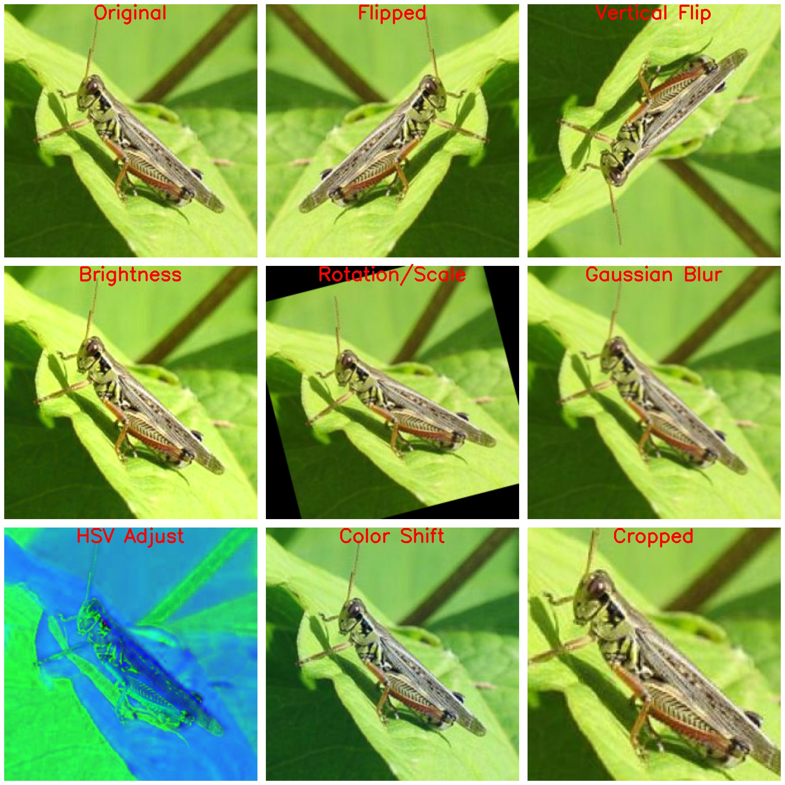
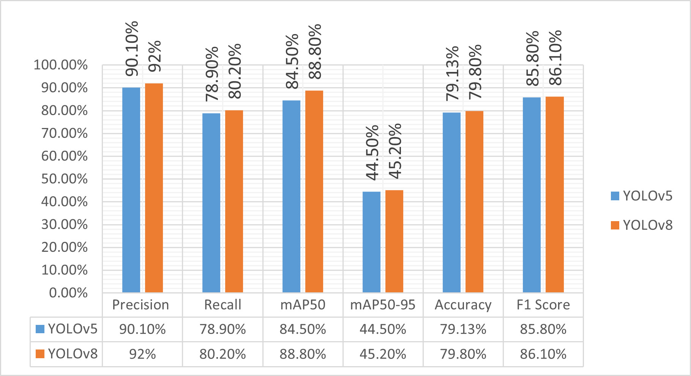
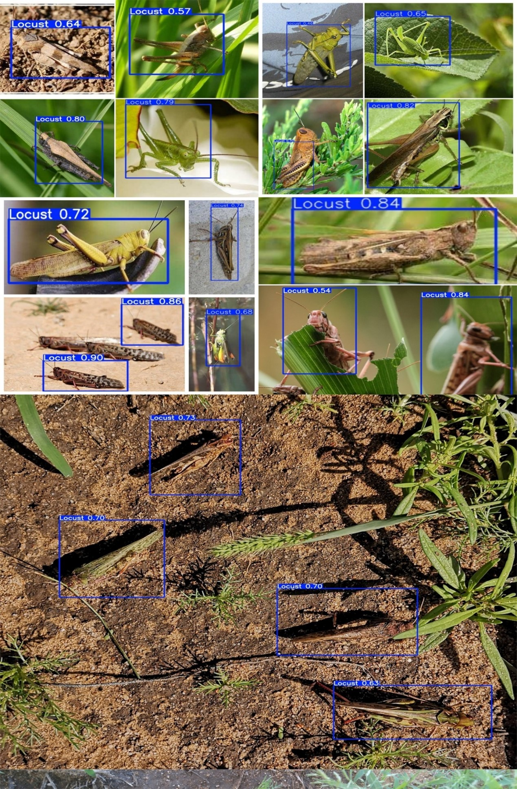
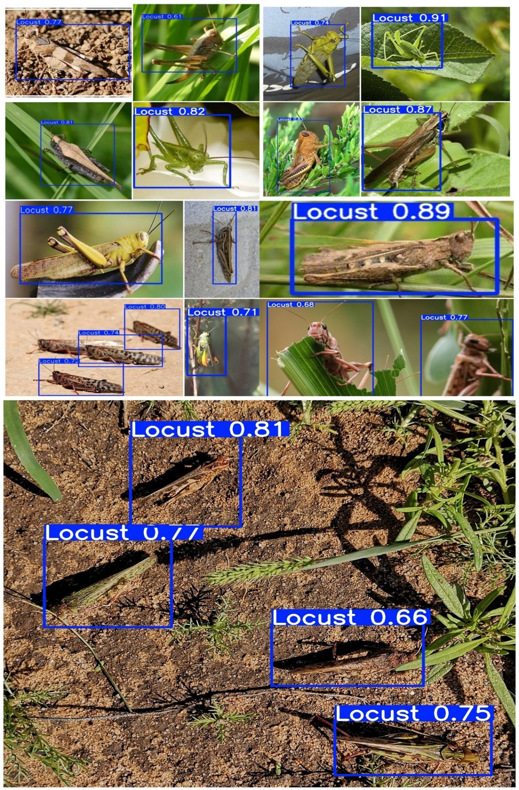

# 🚀 Performance Comparison of YOLOv5 & YOLOv8 on Curated and Augmented Datasets for Locust Detection
🔍 A deep learning-based object detection model for locust identification using YOLOv5 and YOLOv8.

📌 Project Overview

This project aims to detect locusts in images using YOLOv5 and YOLOv8 models. The dataset has been curated, annotated and augmentated specifically for this task.
This repository presents a comparative evaluation of YOLOv5 and YOLOv8 for locust detection. The study was conducted on:

1️⃣ A curated dataset specifically prepared for locust detection.

2️⃣ An augmented version of the dataset, where various augmentation techniques were applied to enhance model robustness.

🔥 Key Findings:

YOLOv8 outperformed YOLOv5 in both scenarios, achieving higher accuracy and better generalization.

Dataset augmentation significantly improved model performance and provide higher mAP (mean Average Precision) and better detection accuracy.

✅ Features

YOLOv5 & YOLOv8 implementations

Custom dataset (without augmentation and with augmentation) for locust detection

Training and inference scripts included

Supports Google Colab for easy execution

📁 Dataset & Model Files

🔹 Curated & Augmented Dataset are available on Zenodo. Dataset DOI: 10.5281/zenodo.14964987
🔹 Code Implementations: Includes training and inference scripts for both YOLOv5 and YOLOv8. 

🎯 Augmentation Techniques Applied

The following augmentation techniques were applied to improve model robustness:

✔ Rotation

✔ Scaling & Cropping

✔ Brightness & Contrast Adjustments

✔ Flipping (Horizontal & Vertical)

✔ Gaussian Noise & Blur

## 📸 Sample output of an image after augmentation 

### **Applied Augmentation Techniques**

🚀 Installation & Setup

1️⃣ Clone the Repository

git clone https://github.com/yourusername/locust-detection.git
cd locust-detection

2️⃣ Install Dependencies

pip install -r requirements.txt

3️⃣ Download the Dataset
Since the dataset is hosted on Zenodo, download it manually from:
🔗 Dataset DOI: 10.5281/zenodo.14964987

Unzip and place it in the correct directory (datasets/).

4️⃣ Mount Google Drive (if using Colab)
from google.colab import drive
drive.mount('/content/drive')

🔧 Training 

Train YOLOv5

!python train.py --img 640 --batch 16 --epochs 60 --data robo.dataset.yaml --weights yolov5s.pt --cache

Train YOLOv8

results = model.train(
    data=dataset_yaml_path,  # Use the correct path here
    epochs=60,
    batch=16,
    imgsz=640,
    save_period=10,
    project=save_model_path,
    name='yolov8_detection'
)

🏆 Inference

Inference YOLOv5

!python detect.py --weights /content/drive/MyDrive/locust_detection/yolov5/runs/train/exp/weights/last.pt \
                   --conf 0.40 --data dataset.yaml \
                   --source /content/drive/MyDrive/locust_detection/test_data/images

Inference YOLOv8

results = model.predict(source=source_directory, conf=0.40, save=True, project=output_directory, name='detection_results')

## 📸 Visual Comparison of Results
Below are performance results:

### **YOLOv5 and YOLOv8 Performance on dataset without Augmentation**

### **YOLOv5 and YOLOv8 Performance on dataset with Augmentation**

Below are sample detection results:

### **YOLOv5 Output**

### **YOLOv8 Output**

📜 Citation

If you use this dataset, please cite the Zenodo DOI:  
🔗 DOI: [10.5281/zenodo.14964987](https://doi.org/10.5281/zenodo.14964987)  

📄 License
🔹 This project is licensed under the MIT License.

🤝 Acknowledgments
Special thanks to Ultralytics for YOLO development.

📬 Contact

For questions, reach out via poojavjpy@gmail.com or https://www.researchgate.net/profile/Pooja-Vajpayee-2/research

